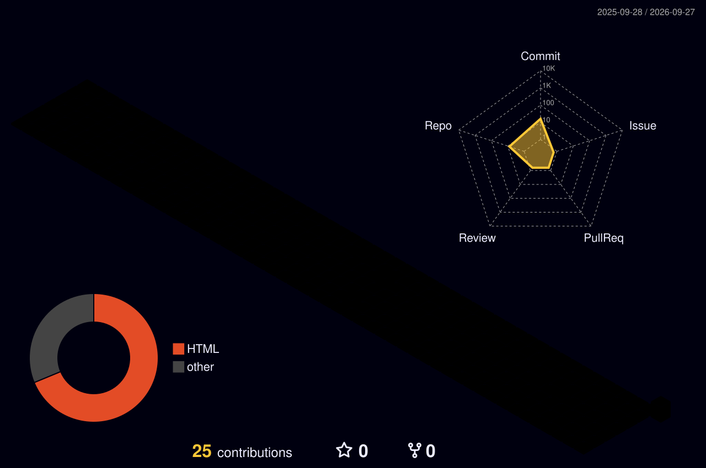

<!-- ============================================================ -->
<!-- 1. TOP BANNER — capsule-render, animated gradient wave       -->
<!-- Service: capsule-render (https://github.com/kyechan99/capsule-render) -->
<!-- type=waving + animation=twinkling gives a moving gradient wave with sparkle -->
<!-- ============================================================ -->

  

<!-- ============================================================ -->
<!-- 2. TYPING ANIMATION — readme-typing-svg                      -->
<!-- Renders an SVG that types/erases each line in a loop, no JS needed -->
<!-- ============================================================ -->

  

<!-- ============================================================ -->
<!-- 3. CONTACT BADGES + PROFILE VIEWS COUNTER                    -->
<!-- shields.io for the badges (always-on badge generator), komarev for the view counter -->
<!-- ============================================================ -->

  
  
  
   
  

---

<!-- ============================================================ -->
<!-- 4. ABOUT ME — text on the left, live GitHub stats card on the right -->
<!-- The table is just a 2-column layout trick, GitHub renders it without borders visible -->
<!-- ============================================================ -->
## 💫 About Me

<table>
<tr>
<td width="60%" valign="top">

### Data & BI Engineer | Data Engineering | Software Development
🎓 Computer Science & Networks Engineering — MIAGE
📍 Rabat, Morocco

I'm interested in **Data Engineering, Business Intelligence, Cloud and AI**.
I enjoy building data-driven applications, dashboards and intelligent tools that turn data into useful and actionable information.

</td>
<td width="40%" valign="top">

</td>
</tr>
</table>

---

<!-- ============================================================ -->
<!-- 5. TECH STACK — skillicons.dev for well-known logos,          -->
<!-- shields.io badges for niche Data/AI terms skillicons doesn't cover -->
<!-- ============================================================ -->
## 🛠️ Tech Stack

**Data & BI** : Python · SQL · PostgreSQL · Power BI · Power Query · DAX

  
   
  
  
  
  

**AI & Data** : RAG · LLM · NLP · NLP-to-SQL · pgvector · sentence-transformers

  
  
  
  
  
  
  

**Cloud** : AWS · Azure

  

**Development** : FastAPI · Django · Flask · Java · Spring Boot · C#/.NET · JavaScript

  

**Tools** : Git · GitHub · Docker

  

---

<!-- ============================================================ -->
<!-- 6. FEATURED PROJECTS — one row per project, badges show the stack -->
<!-- Replace the "#" links with real repo URLs once available          -->
<!-- ============================================================ -->
## 🚀 Featured Projects

<table>
<tr>
<td>

**🤖 BI Assistant IA** — [link](#)
Natural-language BI assistant that converts business questions into SQL queries using **LLM + RAG + PostgreSQL** (built at Al Barid Bank).
 
   

</td>
</tr>
<tr>
<td>

**📊 Business Intelligence Dashboard** — [link](#)
Interactive Power BI solution with **ETL, data modeling, DAX and KPI analysis**, deployed on AWS RDS.
 
   

</td>
</tr>
<tr>
<td>

**⚽ Sentiment Analysis** — [link](#)
NLP application analyzing Reddit discussions about La Liga players using **Python, Flask and Spark**.
 
   

</td>
</tr>
</table>

---

<!-- ============================================================ -->
<!-- 7. DATA ABOUT MY CODE — the "data side" of the profile        -->
<!-- 3D graph is generated by a GitHub Action into ./profile-3d-contrib/ -->
<!-- Stats / top-langs / streak / activity graph are live third-party SVG APIs -->
<!-- ============================================================ -->
## 📈 Data about my code

  

<table>
<tr>
<td width="50%">
  
</td>
<td width="50%">
  
</td>
</tr>
</table>

  

  

  

<!-- ============================================================ -->
<!-- 8. SNAKE ANIMATION — generated by Platane/snk, served from the "output" branch -->
<!-- <picture> switches automatically between the dark/light SVG based on viewer's theme -->
<!-- ============================================================ -->

  <picture>
    <source media="(prefers-color-scheme: dark)" srcset="https://raw.githubusercontent.com/mouadmouji77-source/mouadmouji77-source/output/github-snake-dark.svg" />
    <source media="(prefers-color-scheme: light)" srcset="https://raw.githubusercontent.com/mouadmouji77-source/mouadmouji77-source/output/github-snake.svg" />
    
  </picture>

---

<!-- ============================================================ -->
<!-- 9. CURRENTLY LEARNING + CONNECT                               -->
<!-- ============================================================ -->
## 🌱 Currently Learning

  
  
  
  

## 📫 Connect with me

  
  

<i>⭐ Feel free to explore my repositories.</i>

<!-- ============================================================ -->
<!-- 10. FOOTER BANNER — same gradient as the header, mirrored     -->
<!-- ============================================================ -->

  

